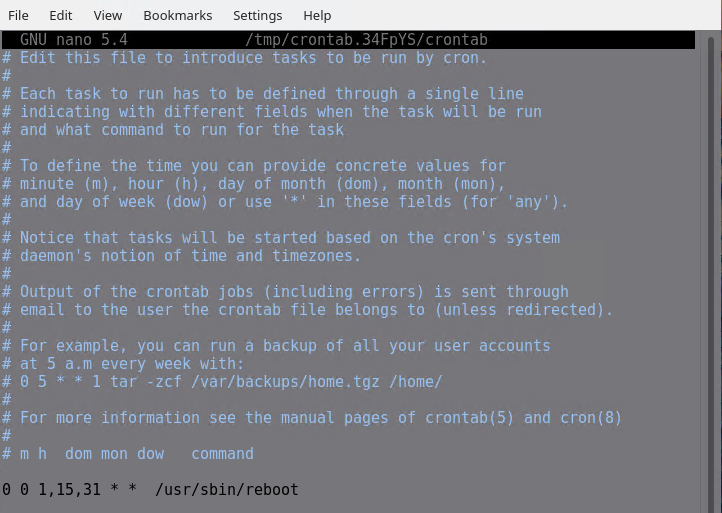
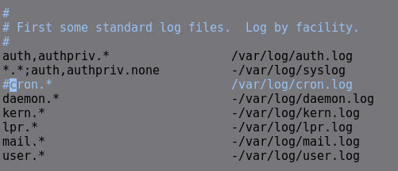
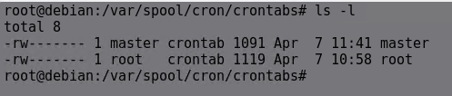

# **Linux Görev Zamanlama**


## **1. `cron` Nedir?**

`cron`, Unix benzeri işletim sistemlerinde görevleri (komutları veya script'leri) belirli zamanlarda veya düzenli aralıklarla otomatik olarak çalıştırmak için kullanılan standart bir zamanlayıcıdır. Bu işlem, arka planda sürekli çalışan `cron` servisi tarafından yönetilir. `cron`, özellikle sistem bakımı, yedekleme, rapor oluşturma gibi tekrarlayan görevler için vazgeçilmezdir.

## **2. `cron` Nasıl Çalışır?**

`cron` servisi başlangıçta çalışır ve belirli aralıklarla (genellikle her dakika) crontab (cron table) dosyalarını kontrol eder. Bu dosyalarda tanımlanan zamanlamalara uyan görevler varsa, ilgili komutları belirtilen kullanıcı yetkileriyle çalıştırır.

## **3. `crontab` Dosya Formatı**

Her kullanıcının kendi görevlerini tanımladığı bir crontab dosyası olabilir. Ayrıca sistem genelinde çalışan görevler için de crontab dosyaları bulunur. Standart kullanıcı crontab dosyasındaki her satır, zamanlanmış bir görevi temsil eder ve 6 temel alandan oluşur:

```
┌───────────── dakika (0 - 59)
│ ┌───────────── saat (0 - 23)
│ │ ┌───────────── ayın günü (1 - 31)
│ │ │ ┌───────────── ay (1 - 12 veya JAN-DEC)
│ │ │ │ ┌───────────── haftanın günü (0 - 6 veya SUN-SAT; 0 ve 7 Pazar'dır)
│ │ │ │ │
* * * * * <çalıştırılacak_komut_veya_script_yolu>
```


**Özel Zamanlama Karakterleri:**

*   `*`: Herhangi bir değer anlamına gelir (örn. `*` dakika alanında "her dakika").
*   `,`: Değer listelerini ayırır (örn. `1,15,30` -> 1., 15. ve 30. dakikalarda).
*   `-`: Bir değer aralığını belirtir (örn. `9-17` -> 9'dan 17'ye kadar her saat).
*   `/`: Adım değerlerini belirtir (örn. `*/10` -> her 10 dakikada bir).

**Özel Zamanlama Dizeleri (Bazı `cron` sürümlerinde desteklenir):**

*   `@reboot`: Sistem başlangıcında bir kez çalıştırılır.
*   `@yearly` veya `@annually`: Her yıl bir kez çalıştırılır (`0 0 1 1 *`).
*   `@monthly`: Her ayın başında bir kez çalıştırılır (`0 0 1 * *`).
*   `@weekly`: Her haftanın başında bir kez çalıştırılır (`0 0 * * 0`).
*   `@daily` veya `@midnight`: Her gün gece yarısı bir kez çalıştırılır (`0 0 * * *`).
*   `@hourly`: Her saat başında bir kez çalıştırılır (`0 * * * *`).

## **4. `crontab` Komutu**

Kullanıcılar, kendi crontab dosyalarını yönetmek için `crontab` komutunu kullanırlar.

*   **`crontab -e`**: Mevcut kullanıcının crontab dosyasını varsayılan metin düzenleyici (genellikle `vi` veya `nano`) ile açar. Değişiklikler kaydedildiğinde, `cron` tarafından hemen algılanır ve uygulanır.
*   **`crontab -l`**: Mevcut kullanıcının crontab dosyasının içeriğini görüntüler.
*   **`crontab -r`**: Mevcut kullanıcının crontab dosyasını **kalıcı olarak siler**. Bu komut genellikle onay istemediği için dikkatli kullanılmalıdır.
*   **`crontab -u <kullanıcı_adı>`**: (Yalnızca root yetkisiyle) Belirtilen kullanıcının crontab dosyasını yönetmek (düzenlemek, listelemek, silmek) için kullanılır. Örn: `sudo crontab -u www-data -e`
*   **`crontab <dosya_adı>`**: Belirtilen dosyayı yeni crontab olarak yükler. Bu, mevcut crontab'ın üzerine yazar.

## **5. Sistem Geneli Crontab Dosyaları ve Dizinleri**

Kullanıcı bazlı crontab'ların yanı sıra, sistem yöneticilerinin kullandığı sistem geneli zamanlama mekanizmaları da vardır:

*   **/etc/crontab**: Ana sistem crontab dosyasıdır. Kullanıcı crontab formatından farklı olarak, komuttan önce çalıştırılacak **kullanıcı adını** belirten ek bir alana sahiptir.
    ```
    # /etc/crontab: system-wide crontab
    SHELL=/bin/sh
    PATH=/usr/local/sbin:/usr/local/bin:/sbin:/bin:/usr/sbin:/usr/bin

    # m h dom mon dow user  command
    17 *    * * *   root    cd / && run-parts --report /etc/cron.hourly
    25 6    * * *   root    test -x /usr/sbin/anacron || ( cd / && run-parts --report /etc/cron.daily )
    47 6    * * 7   root    test -x /usr/sbin/anacron || ( cd / && run-parts --report /etc/cron.weekly )
    52 6    1 * *   root    test -x /usr/sbin/anacron || ( cd / && run-parts --report /etc/cron.monthly )
    ```
*   **/etc/cron.d/**: Bu dizine konulan dosyalar da sistem geneli crontab görevi görür. Paket yöneticileri veya uygulamalar genellikle kendi zamanlanmış görevlerini buraya eklerler. Buradaki dosyalar `/etc/crontab` ile aynı formatı (kullanıcı adı alanı dahil) kullanır ve dosya adlarında genellikle nokta (`.`) veya özel karakterler bulunmamalıdır.
*   **/etc/cron.hourly/**: Bu dizine yerleştirilen çalıştırılabilir script'ler genellikle saat başı (`/etc/crontab` içindeki `run-parts` satırına göre) çalıştırılır.
*   **/etc/cron.daily/**: Bu dizine yerleştirilen script'ler genellikle her gün (`/etc/crontab`'daki ayarlara göre, sıklıkla gece geç saatlerde) çalıştırılır.
*   **/etc/cron.weekly/**: Bu dizine yerleştirilen script'ler genellikle her hafta (`/etc/crontab`'daki ayarlara göre) çalıştırılır.
*   **/etc/cron.monthly/**: Bu dizine yerleştirilen script'ler genellikle her ay (`/etc/crontab`'daki ayarlara göre) çalıştırılır.

    *Not:* `cron.*` dizinlerindeki script'ler, isimlerine göre sıralanarak `run-parts` komutu aracılığıyla çalıştırılır. Bu script'lerin çalıştırılabilir (`chmod +x`) olması gerekir.

## **6. `cron` Örnekleri**

Elbette, belirtilen `cron` zamanlama ayarlarının açıklamaları aşağıdadır:

1.  `5 0 * 8 *`
    *   **Anlamı:** Her yılın **Ağustos ayında**, **her gün**, saat **00:05'te** (gece yarısını 5 geçe) çalışır.

2.  `15 14 1 * *`
    *   **Anlamı:** **Her ayın 1. gününde**, saat **14:15'te** (öğleden sonra 2'yi çeyrek geçe) çalışır.

3.  `0 22 * * 1-5`
    *   **Anlamı:** **Hafta içi her gün** (Pazartesi'den Cuma'ya kadar, Cumartesi ve Pazar hariç), saat **22:00'da** (akşam 10'da) çalışır.

4.  `23 0-20/2 * * *`
    *   **Anlamı:** **Her gün**, saat **00:23, 02:23, 04:23, 06:23, 08:23, 10:23, 12:23, 14:23, 16:23, 18:23 ve 20:23'te** çalışır. (Yani, saat 0'dan 20'ye kadar olan çift saatlerin 23. dakikasında).

5.  `5 4 * * sun` (veya `5 4 * * 0` veya `5 4 * * 7`)
    *   **Anlamı:** **Her Pazar günü**, sabah saat **04:05'te** çalışır.

6.  `0 0,12 1 */2 *`
    *   **Anlamı:** **İki ayda bir** (Ocak, Mart, Mayıs, Temmuz, Eylül, Kasım aylarında), **ayın 1. gününde**, saat **00:00** (gece yarısı) ve **12:00'da** (öğlen) çalışır.

7.  `0 4 8-14 * *`
    *   **Anlamı:** **Her ayın 8'i ile 14'ü arasındaki günlerde** (8'i ve 14'ü dahil), sabah saat **04:00'da** çalışır.

8.  `0 0 1,15 * 3`
    *   **Anlamı:** Bu cron girdisi, her ayın 1’i ve 15’i Çarşamba gününe denk geliyorsa, 00:00'da çalışır.

Aşağıda örnek olarak kullanıcının crontab dosyasına  her ayın 1. 15. ve 31. günlerinde saat 00.00'da sisteme reboot atılması için bir görev zamanlaması yapılmıştır.



[1](#kaynakça)

## **7. Loglama ve Hata Ayıklama**

`cron` görevlerinin çalışıp çalışmadığını veya hata verip vermediğini kontrol etmek için sistem loglarına bakmak gerekir:

*   Çoğu sistemde `cron` logları `/var/log/syslog` veya `/var/log/cron` dosyasına yazılır.
*   `grep CRON /var/log/syslog` (veya ilgili log dosyası) komutu ile `cron` ile ilgili log girdileri filtrelenebilir.
*  `cron`logları için ayrı bir dosya oluşturulmasını istiyorsanız `sudo nano /etc/rsyslog.conf ` dosyasında aşağıdaki satırı aktif hale getirin ve ardından reboot atın. Artık  `/var/log/cron.log` dosyasından cron loglarını takip edebilirsiniz.

`

* `/var/spool/cron/crontabs` dizininde kullanıcıların crontab dosyaları bulunur.

`

## **KAYNAKÇA**

[[1]](https://crontab.guru/examples.html)